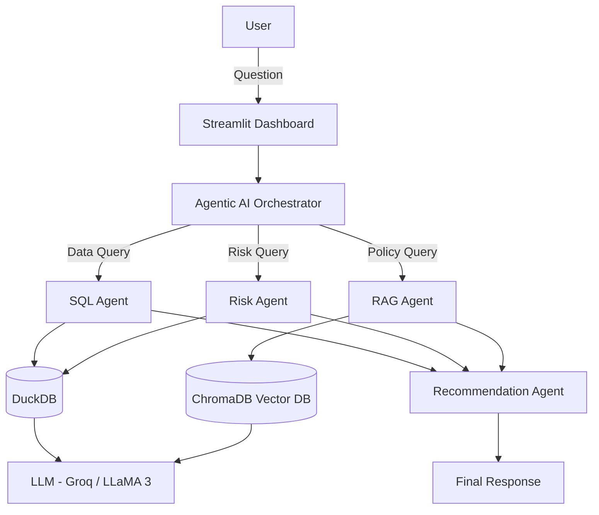
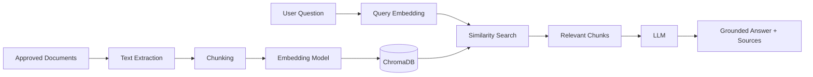
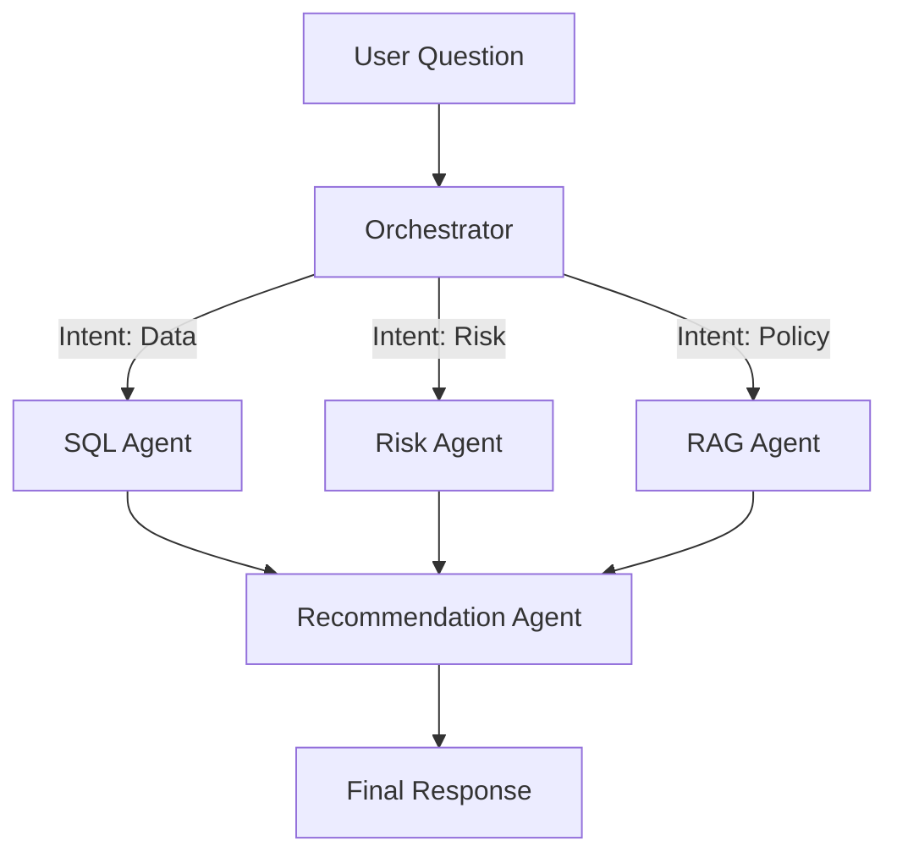

# Healthcare Medication Adherence Analytics
## Knowledge Base (RAG) & Agentic AI Orchestrator
### Complete Project Documentation

---

## 1. PROJECT OVERVIEW

This project is a healthcare-focused AI application combining:

1. **Analytics Assistant (SQL + AI)** — Natural language to SQL for structured data.
2. **Healthcare Knowledge Base (RAG)** — Document-grounded knowledge retrieval.
3. **Agentic AI Orchestrator** — Multi-agent coordination for complex queries.

> **Important Disclaimer:** This system uses synthetic data. It is NOT a medical diagnosis system. Recommendations are business prioritization suggestions only.

---

## 2. EXECUTIVE SUMMARY

**Problem:** Healthcare organizations must analyze patient adherence data and navigate complex policy documents simultaneously — a task too slow for manual effort.

**Solution:** A unified AI platform that translates natural language questions into database queries, semantically searches policy documents, and synthesizes combined answers through specialized AI agents.

**Technology Stack:** Python · DuckDB · ChromaDB · Groq (LLaMA 3) · LangGraph · Streamlit

**Expected Benefits:** Faster analysis, reduced manual effort, document-grounded responses with source citations, business prioritization support.

**Major Limitations:** Data quality dependency, LLM latency, synthetic data constraints, human oversight requirement.

---

## 3. SYSTEM ARCHITECTURE

*Fig. 1. Overall System Architecture*

---

## 4. ANALYTICS QUESTIONS

| # | Question | Agents Involved |
|---|---------|----------------|
| 1 | High-risk patients by region? | SQL Agent |
| 2 | Highest missed refill pharmacies? | SQL Agent |
| 3 | Average refill gap — North? | SQL Agent |
| 4 | Monthly adherence trend? | SQL Agent |
| 5 | Lowest adherence medication? | SQL Agent |
| 6 | North vs South adherence? | SQL Agent |

---

## 5. RAG PIPELINE

*Fig. 2. RAG Pipeline*

---

## 6. MULTI-AGENT WORKFLOW

*Fig. 3. Multi-Agent Orchestration*

---

## 7. TECHNOLOGY STACK

| Technology | Role | Confirmed |
|------------|------|-----------|
| Python | Core logic | Yes |
| DuckDB | Relational database | Yes |
| ChromaDB | Vector database | Yes |
| Groq (LLaMA 3) | LLM | Yes |
| LangGraph | Agent orchestration | Yes |
| Streamlit | UI Dashboard | Yes |
| sentence-transformers | Embeddings | Yes |

---

## 8. DATA ANALYTICS METRICS

- **Medication Adherence Rate** = (On-time refills / Total refills) × 100
- **Missed Refill Rate** = (Missed refills / Total refills) × 100
- **Refill Gap** = Actual pickup date − Expected pickup date (days)
- **MPR** = Total days supply / Measurement period days
- **PDC** = Unique days covered / Measurement period days

---

## 9. KEY GLOSSARY

| Term | Definition |
|------|-----------|
| RAG | Retrieval-Augmented Generation — grounding LLM answers in documents |
| Embedding | Text converted to a numerical vector capturing meaning |
| Vector DB | Database optimized for similarity search on embeddings |
| LLM | Large Language Model — AI that understands and generates language |
| Agent | AI equipped with specific tools and tasks |
| Orchestrator | Manager AI that routes tasks to specialized agents |
| MPR | Medication Possession Ratio |
| PDC | Proportion of Days Covered |
| Hallucination | When an AI generates confident but incorrect information |
| Synthetic Data | Fake data generated to mimic real-world patterns |
