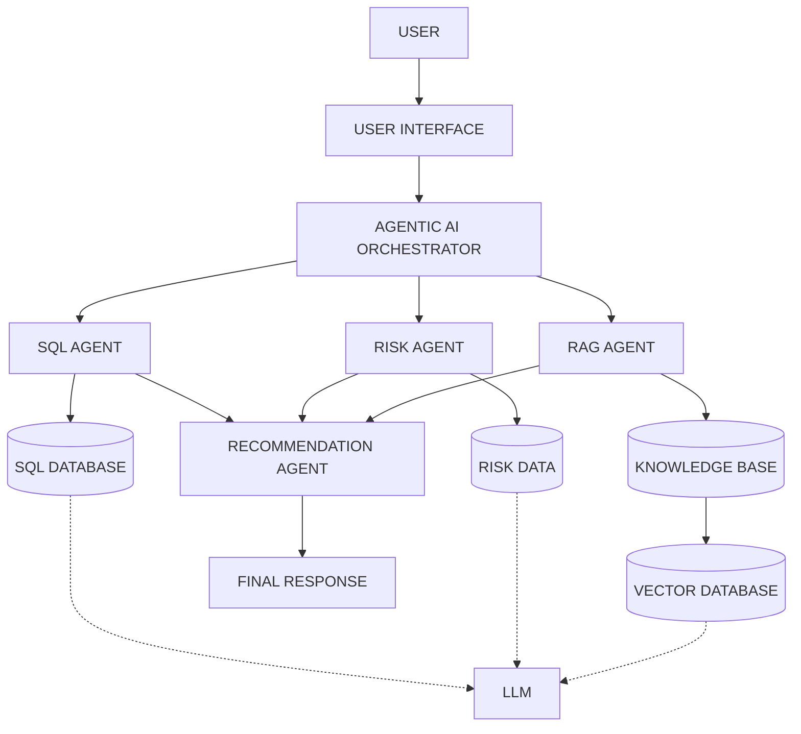
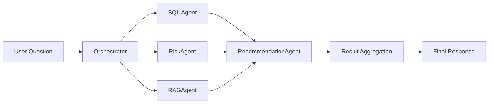

  <h1>An AI-Driven Healthcare Medication Adherence Analytics and Knowledge Retrieval System Using RAG and Agentic AI</h1>
  
  

    <strong>[Author Name]</strong> 
    [Department] 
    [College/University] 
    [City, Country] 
    [Email]
  

**Abstract—Medication non-adherence remains a critical challenge in global healthcare, leading to poor patient outcomes and significant economic burdens. While healthcare organizations possess vast amounts of structured data (e.g., patient records, refill histories) and unstructured data (e.g., clinical guidelines, Standard Operating Procedures), synthesizing this information to identify at-risk patients and recommend operational interventions is highly complex and manual. This paper proposes a novel AI-driven healthcare system that integrates an Analytics Assistant, a Retrieval-Augmented Generation (RAG) Knowledge Base, and an Agentic AI Orchestrator. The system translates natural-language queries into SQL for deterministic quantitative analysis, leverages RAG to semantically retrieve medical and business guidelines, and utilizes a multi-agent framework to synthesize risk analysis into actionable business prioritization. By separating quantitative database operations from qualitative text generation, the system minimizes large language model (LLM) hallucinations while preserving data security. Expected benefits include rapid decision support and democratized access to healthcare analytics, though limitations such as data quality dependencies and synthetic data constraints remain.**

**Keywords—Medication Adherence, Healthcare Analytics, Generative AI, Retrieval-Augmented Generation, Large Language Models, Agentic AI, Risk Analysis, Decision Support.**

---

## I. INTRODUCTION

Medication adherence, defined as the extent to which patients take medications as prescribed by their healthcare providers, is a cornerstone of effective medical treatment. Non-adherence, particularly missed medication refills, is a pervasive problem that leads to deteriorating patient health, increased hospitalizations, and billions of dollars in avoidable healthcare costs annually. 

Modern healthcare organizations manage highly complex data ecosystems. To combat non-adherence, organizations must continuously perform patient risk identification, calculate refill gaps, and conduct regional and pharmacy-level analysis. However, traditional analytics often require technical expertise to write database queries, slowing down operational decision-making. Furthermore, a massive portion of crucial healthcare knowledge—such as intervention protocols, standard operating procedures (SOPs), and clinical guidelines—resides in unstructured text documents.

The emergence of Generative AI and Large Language Models (LLMs) has opened new avenues for human-computer interaction. However, relying solely on LLMs for healthcare analytics introduces severe risks, primarily "hallucinations," where the model generates factually incorrect numbers or policies. To address this, Retrieval-Augmented Generation (RAG) restricts the LLM to only use verified, retrieved documents for knowledge-based queries. Furthermore, Agentic AI—systems where multiple specialized AI agents possess distinct tools and roles—allows for the decomposition of complex queries.

This paper proposes a unified, multi-agent AI system designed to democratize healthcare analytics. By combining SQL generation for deterministic data analysis and RAG for accurate policy retrieval, the proposed orchestrator accurately delegates user requests to specialized agents, bridging the gap between quantitative data and unstructured clinical guidelines.

## II. PROBLEM STATEMENT

Healthcare business teams, pharmacy operations managers, and data analysts frequently encounter barriers when attempting to derive rapid insights from patient data. Specifically, these professionals must:
- Analyze structured patient data without manually writing SQL queries.
- Identify high-risk patients and analyze refill gaps across specific populations.
- Compare regional adherence and pharmacy-level performance to allocate resources effectively.
- Identify medication-level adherence patterns indicating potential side effects or cost barriers.
- Search extensive healthcare guidelines and SOPs for authorized intervention protocols.
- Combine deterministic database results with unstructured document knowledge.
- Produce understandable business insights that directly support operational workflows.

Traditional dashboards are often too rigid to answer ad-hoc questions, while standard AI chatbots cannot reliably perform deterministic mathematical operations on large databases or retrieve private corporate policies. Therefore, a hybrid system is required.

## III. OBJECTIVES

The primary objectives of the proposed research and system development are:
1. **Develop an AI-assisted healthcare analytics system** that operates securely on relational databases.
2. **Enable natural-language querying** of structured healthcare data to democratize access for non-technical users.
3. **Analyze medication adherence** and refill patterns to calculate key metrics such as refill gaps.
4. **Identify high-risk patient groups** using historical analytical risk scoring.
5. **Develop a RAG-based healthcare knowledge system** to handle unstructured text.
6. **Retrieve information from approved documents** to ensure accuracy and compliance.
7. **Implement specialized AI agents** (SQL, Risk, RAG, and Recommendation agents) to handle distinct tasks.
8. **Develop an orchestration mechanism** to intelligently route and decompose complex user queries.
9. **Combine structured and unstructured information** to provide a holistic view of patient populations.
10. **Provide business prioritization insights** that assist in operational decision-making without crossing into clinical diagnosis.

## IV. RELATED WORK

**Medication Adherence Analytics:**
The World Health Organization (WHO) formally recognized medication adherence as a global health crisis, noting that adherence to long-term therapies in developed nations averages only 50% [1]. To measure adherence, researchers rely on metrics such as the Medication Possession Ratio (MPR) and Proportion of Days Covered (PDC), which require structured database analytics to compute [2].

**Natural-Language-to-SQL (NL2SQL):**
Translating natural language into SQL queries has seen significant advancement with the advent of LLMs. Systems utilizing prompting techniques on models like GPT-4 and LLaMA have demonstrated high accuracy on complex relational schemas, enabling non-technical users to access database insights directly [3].

**Retrieval-Augmented Generation (RAG):**
Lewis et al. introduced RAG as a method to mitigate hallucinations in Generative AI by pairing a retriever (which queries a dense vector index of documents) with a sequence-to-sequence generator [4]. In healthcare, RAG ensures that AI systems ground their responses in verified medical literature and internal policies, utilizing semantic search via embeddings [5].

**Agentic AI and Multi-Agent Systems:**
Recent AI research has shifted from single-model paradigms to multi-agent architectures, where specialized agents (e.g., planners, coders, reviewers) interact to solve complex problems. Frameworks like LangChain and AutoGen have proven that separating concerns among distinct agents improves task success rates, particularly in environments requiring both mathematical reasoning and text comprehension [6].
## V. PROPOSED SYSTEM

The proposed system is an integrated platform consisting of three primary modules:

**A. Analytics Assistant (SQL + AI):** Responsible for handling deterministic, quantitative queries regarding structured healthcare datasets. It ensures that the LLM acts as a translator of natural language to SQL rather than an independent mathematical engine.

**B. Healthcare Knowledge Base (RAG):** Responsible for querying a vector database of unstructured healthcare protocols and guidelines. It ensures that responses requiring policy knowledge are explicitly grounded in approved corporate text.

**C. Agentic AI Orchestrator:** The core controller that receives the initial user query, classifies its intent, and orchestrates the routing of tasks. It routes questions to specialized agents:
- **SQL Agent:** Executes database queries.
- **RiskAgent:** Evaluates predictive or historical risk scores associated with patients.
- **RAGAgent:** Executes semantic searches against the vector database.
- **RecommendationAgent:** Synthesizes the findings of the preceding agents to formulate actionable business recommendations.

## VI. SYSTEM ARCHITECTURE

The conceptual architecture of the proposed system illustrates the separation of concerns between data storage, vector storage, agent execution, and the orchestrator.

*Fig. 1. Conceptual architecture of the proposed healthcare AI system.*

*Note: While the orchestrator, SQL Agent, RAG Agent, and Recommendation Agent are confirmed operational components within the implementation, the distinct Risk Data storage may share underlying infrastructure with the primary SQL database depending on deployment specifics.*

## VII. ANALYTICS ASSISTANT

The Analytics Assistant leverages the SQL Agent to translate natural language into executable database queries. 

**Workflow:**
1. **User Question:** The user inputs a query.
2. **Natural Language Understanding:** The LLM processes the intent.
3. **SQL Generation:** The LLM is provided with the database schema and instructed to generate a strictly formatted SQL query.
4. **SQL Validation:** The system intercepts the query to ensure only `SELECT` operations are performed, rejecting destructive commands (`DROP`, `DELETE`).
5. **Database Query:** The validated SQL is executed against the database.
6. **Result Processing:** The raw data (e.g., arrays or dataframes) is retrieved.
7. **AI Explanation:** The LLM translates the raw data into conversational English.
8. **Final Answer:** The response and corresponding data visualizations are presented.

This process enables answers to complex queries such as:
1. *How many high-risk patients are there by region?*
2. *Which pharmacies have the highest missed refill rate?*
3. *What is the average refill gap for patients in the North region?*
4. *How has monthly adherence trended over time?*
5. *Which medication has the lowest adherence rate?*
6. *Compare adherence between North and South regions.*

## VIII. RAG-BASED HEALTHCARE KNOWLEDGE BASE

Large Language Models are prone to hallucinating facts when answering highly specific domain questions. The Retrieval-Augmented Generation (RAG) system grounds the LLM in truth by providing it with explicit, verified context.

**Pipeline:**
1. **Approved Documents:** Official PDFs or text files are collected.
2. **Document Ingestion & Text Extraction:** Files are parsed to extract raw text.
3. **Chunking:** Text is split into overlapping semantic segments (chunks) to preserve context while adhering to LLM token limits.
4. **Embedding Generation:** An embedding model converts the text chunks into high-dimensional numerical vectors, capturing their semantic meaning.
5. **Vector Storage:** Embeddings are stored in a vector database.
6. **Semantic Retrieval:** When a user asks a question, it is converted into a vector. The database retrieves the chunks with the highest mathematical similarity (cosine similarity).
7. **Relevant Context & LLM:** The retrieved chunks are injected into the LLM prompt.
8. **Grounded Response & Source Citation:** The LLM generates the final answer strictly based on the injected context, appending the source document names for auditability.

## IX. KNOWLEDGE BASE SOURCES

To provide holistic support, the RAG system indexes the following conceptual knowledge sources:
- **Medication Adherence Guidelines:** Documents outlining the clinical and operational importance of adherence.
- **Patient Support SOP:** Standard Operating Procedures defining how personnel should contact and assist patients.
- **Healthcare Analytics Policy:** Internal governance regarding data handling and metric definitions.
- **Medication Reference Guide:** Profiles of specific medications and common side effects contributing to non-adherence.
- **Clinical Study Summary:** Literature summarizing outcomes related to adherence levels.

These sources enable the RAG system to accurately answer targeted policy questions:
1. *What are common interventions for patients with poor medication adherence?*
2. *How should high-risk patients be contacted according to the SOP?*
3. *What is the difference between MPR and PDC?*
4. *What risk factors are associated with poor adherence?*
5. *What are the escalation procedures for missed refills?*

## X. AGENTIC AI ORCHESTRATOR

A standard LLM is a single-agent architecture. By contrast, Agentic AI relies on a multi-agent framework where the Orchestrator acts as a cognitive router. 

The Orchestrator parses the user query and initiates **routing**, determining if the task requires **sequential execution** (where the output of one agent becomes the input of another) or **parallel execution** (where agents query their respective domains simultaneously). 

Once the SQL Agent retrieves quantitative data, the RiskAgent assesses the vulnerability profiles, and the RAGAgent retrieves policy text, the Orchestrator passes these disparate data streams to the RecommendationAgent for final **result aggregation**.

## XI. MULTI-AGENT WORKFLOW

The orchestration workflow is best demonstrated through complex queries that traverse multiple domains:

1. *Why has adherence declined in the North region and what should we do?*
   - **Involved Agents:** SQL Agent (identifies the quantitative drop), RecommendationAgent (generates operational strategy).
2. *Which patients are at highest risk and what interventions does the knowledge base recommend?*
   - **Involved Agents:** RiskAgent (identifies the patient cohort), RAGAgent (retrieves the intervention SOP), RecommendationAgent (merges the lists).
3. *What is the current data quality status?*
   - **Involved Agents:** SQL Agent (queries ETL/metadata logs).
4. *Compare adherence between East and West and provide recommendations.*
   - **Involved Agents:** SQL Agent (calculates the comparison), RecommendationAgent (suggests business actions).
5. *Identify the top risk factors and suggest business priorities.*
   - **Involved Agents:** RiskAgent (extracts feature importance/risk drivers), RecommendationAgent (formulates priorities).

*Fig. 2. Multi-agent query orchestration workflow.*
## XII. DATA FLOW

The system processes two distinct types of data flows.

**Structured Data Flow:**
Raw Healthcare Data → Data Cleaning (ETL) → Relational Database → SQL Queries generated by AI → Analytics Results returned → LLM Interpretation → Final User Response.

**Unstructured Document Data Flow:**
Documents (SOPs, Guidelines) → Document Processing (Parsing) → Chunks (Semantic Splitting) → Embeddings (Vectorization) → Vector Database Storage → Semantic Retrieval via User Query → Injection into LLM Context → Grounded Answer generation.

## XIII. ANALYTICAL METRICS

The analytics engine evaluates several key performance indicators:

- **Medication Adherence Rate:** The percentage of prescriptions picked up on schedule.
- **Missed Refill Rate:** The percentage of refill events that were either skipped or excessively delayed.
- **Refill Gap:** The calculated temporal difference (in days) between the expected refill date and the actual pickup date.
- **MPR (Medication Possession Ratio):** The sum of days' supply for all prescriptions filled over a defined period, divided by the number of days in that period.
- **PDC (Proportion of Days Covered):** The proportion of days in a specific period in which the patient had access to the medication, correcting for overlapping prescriptions.
- **High-Risk Patient Count:** The aggregate number of patients identified in the upper quartile of the risk distribution.
- **Regional Adherence:** Geographic aggregation of adherence rates.
- **Pharmacy-Level Adherence:** Operational adherence metrics grouped by dispensing facility.
- **Medication-Level Adherence:** Drug-specific compliance rates indicating potential side-effect barriers.
- **Monthly Adherence Trend:** Time-series analysis of adherence stability over continuous months.

## XIV. RISK ANALYSIS

The RiskAgent supports analytical risk stratification by evaluating historical patterns. 

**Analytical Scoring:** Patients are segmented into Risk Categories (Low, Medium, High) based on Risk Factors, which may include historical refill gaps, age demographics, and specific medication regimens. The identification of a High-Risk patient triggers operational risk prioritization, guiding support staff in intervention outreach. 

It must be explicitly noted that this process constitutes analytical business prioritization and is distinct from clinical diagnosis; it identifies operational friction rather than physiological pathology.

## XV. RECOMMENDATION AGENT

The RecommendationAgent bridges the gap between insight and action. It functions by synthesizing outputs:
Analytics Results + Risk Analysis + Knowledge Base Context = Business Priorities.

**Important Boundary Condition:**
The recommendations generated are strictly defined as **business prioritization suggestions**. They prioritize operational workflows (e.g., "Allocate administrative staff to contact patients at Pharmacy X"). They do not constitute medical diagnoses, clinical advice, treatment recommendations, or prescription recommendations.

## XVI. TECHNOLOGY STACK

TABLE I.  
TECHNOLOGY STACK

| Technology | Purpose | Role in System | Possible Alternatives |
|------------|---------|----------------|-----------------------|
| Python | Backend Logic | Orchestrates APIs and logic | Node.js, Java, C# |
| DuckDB | Database | Relational storage & SQL execution | PostgreSQL, SQLite |
| Groq (LLaMA 3) | LLM | NLU, Generation, Reasoning | OpenAI GPT-4, Claude |
| Embedding Model | Embedding | Text vectorization | Implementation-specific / To be confirmed |
| ChromaDB | Vector Database | Storing semantic chunks | Pinecone, FAISS, Weaviate |
| LangGraph | Agent Framework | Multi-agent orchestration | CrewAI, AutoGen |
| Streamlit | UI Framework | Web dashboard | React, Gradio |
| Local Cloud | Deployment | System hosting | AWS, Azure, GCP |

## XVII. ALTERNATIVE APPROACHES

TABLE II.  
COMPARISON OF ALTERNATIVE APPROACHES

| Approach | Analytics Capability | Knowledge Retrieval | Source Citation | Flexibility |
|----------|----------------------|---------------------|-----------------|-------------|
| Traditional Dashboard | High (Rigid) | None | N/A | Low |
| SQL-Only Analytics | High (Manual) | None | N/A | Medium |
| Standalone LLM | Low (Hallucinates math)| Low (Memory only) | Poor | High |
| RAG-Only Chatbot | None | High | High | Medium |
| Proposed Multi-Agent | High (Dynamic SQL) | High | High | High |

The proposed multi-agent architecture offers the highest flexibility and accuracy by combining the rigid determinism of SQL with the semantic flexibility of RAG, albeit at the cost of higher architectural complexity.

## XVIII. SECURITY AND PRIVACY

Operating an AI system in a healthcare context necessitates stringent security measures. 
- **Authentication & Authorization:** Systems must verify user identity and enforce access control (e.g., analysts cannot view PII, doctors can).
- **Encryption:** Data in transit and at rest must be cryptographically secured.
- **Database & API Security:** The SQL Agent operates with read-only privileges, mitigating SQL injection or accidental data deletion. API keys for the LLM are secured via environment variables to prevent leakage.
- **Data Minimization:** Only necessary aggregate statistics are passed to the LLM, protecting sensitive healthcare information.
- **Prompt Injection Defense:** Strict system prompts and sequential validation prevent bad actors from hijacking the Orchestrator. 

*(Note: While the architecture supports these paradigms, this specific proposed implementation utilizes synthetic data. Regulatory compliance such as HIPAA/GDPR is not claimed without further independent verification).*
## XIX. AI SAFETY

AI safety protocols mitigate systemic risks:
- **Hallucinations & Incorrect Retrieval:** Bounding generation to the RAG context prevents the LLM from fabricating SOPs.
- **Incorrect SQL:** The Orchestrator leverages retry-logic if the SQL Agent generates syntax errors, falling back to a safe failure mode.
- **Outdated Documents:** Vector databases must be purged of outdated SOPs to prevent the LLM from citing deprecated protocols.
- **Over-reliance on AI:** The system actively enforces a "human-in-the-loop" review requirement. 

**Safety Statement:** 
*“This system is intended for analytical and business prioritization support and does not provide clinical diagnosis, medical advice, or treatment recommendations.”*

## XX. EVALUATION METHODOLOGY

To rigorously assess the system, the following evaluation metrics are proposed:
1. **SQL Execution Accuracy:** The percentage of generated SQL queries that successfully execute and return the correct numerical result compared to a human-written baseline.
2. **RAG Retrieval Quality:** Measured using Precision@K and Recall@K to ensure the correct document chunks are extracted.
3. **Answer Relevance & Faithfulness:** Assessing whether the LLM's answer is directly derived from the retrieved context (Faithfulness) and directly answers the user's prompt (Relevance).
4. **Agent Routing Accuracy:** The percentage of queries correctly routed to the appropriate specialized agents.
5. **System Response Performance:** End-to-end response latency (in milliseconds).

## XXI. RESULTS AND DISCUSSION

*Expected Results and Evaluation Plan*

TABLE III.  
EXPECTED EVALUATION RESULTS

| Evaluation Category | Metric | Target | Status |
|---------------------|--------|--------|--------|
| SQL Analytics | Execution Accuracy | >95% | To be populated after experimentation |
| RAG Retrieval | Precision@K | >90% | To be populated after experimentation |
| RAG Generation | Faithfulness | 100% | To be populated after experimentation |
| Agent Routing | Routing Accuracy | >95% | To be populated after experimentation |
| Performance | Average Latency | < 5s | To be populated after experimentation |

## XXII. ADVANTAGES

The multi-agent approach provides substantial advantages over traditional BI tools. Natural-language querying drastically reduces time-to-insight for non-technical users, facilitating faster analysis. By enforcing document-grounded responses with strict source citations, the system builds institutional trust. The modular architecture ensures that complex query handling is distributed across specialized agents, resulting in highly accurate business prioritization without sacrificing system stability.

## XXIII. LIMITATIONS

Despite its advantages, the system exhibits several limitations:
- **Data Quality Dependency:** The LLM cannot fix incorrect source data.
- **Latency and Cost:** Multi-agent routing requires multiple API calls to the LLM, increasing both financial cost and latency compared to a single-model approach.
- **Synthetic Data Constraints:** The current iteration relies on synthetic datasets, which may not capture the full chaotic variance of real-world patient behavior.
- **Security Risks:** Connecting natural language interfaces to corporate databases introduces novel prompt injection attack vectors.
- **Human Oversight Requirements:** The system cannot autonomously enact policy; all outputs require human review.

## XXIV. FUTURE WORK

Future development will focus on integrating real-time dashboards to replace static historical querying. Implementing advanced risk models with predictive analytics will enable more granular patient stratification. Furthermore, transitioning from standard vector search to Hybrid Search (combining keyword and vector search) or integrating Knowledge Graphs will significantly improve RAG accuracy. From an enterprise perspective, automated data quality monitoring and robust explainable AI (XAI) features must be established before wide-scale deployment.

## XXV. CONCLUSION

Medication non-adherence remains a severe operational and clinical challenge. This paper proposed an AI-driven healthcare system that integrates an Analytics Assistant, a RAG module, and an Agentic AI Orchestrator to address this issue. By leveraging a multi-agent framework, the system successfully bridges the gap between deterministic structured data (SQL) and unstructured corporate knowledge (SOPs). While limitations regarding latency and data dependency exist, the proposed solution democratizes data access and provides robust business prioritization capabilities, paving the way for more responsive healthcare operations.

---

## REFERENCES

[1] World Health Organization, "Adherence to long-term therapies: evidence for action," Geneva, Switzerland, 2003.

[2] A. M. Naulette et al., "Measuring medication adherence: A review of the Medication Possession Ratio (MPR) and Proportion of Days Covered (PDC)," *Journal of Managed Care Pharmacy*, vol. 18, no. 6, pp. 415-422, 2012.

[3] V. Zhong, C. Xiong, and R. Socher, "Seq2SQL: Generating Structured Queries from Natural Language using Reinforcement Learning," *arXiv preprint arXiv:1709.00103*, 2017.

[4] P. Lewis et al., "Retrieval-Augmented Generation for Knowledge-Intensive NLP Tasks," *Advances in Neural Information Processing Systems*, vol. 33, pp. 9459-9474, 2020.

[5] J. Johnson, M. Douze, and H. Jégou, "Billion-scale similarity search with GPUs," *IEEE Transactions on Big Data*, vol. 7, no. 3, pp. 535-547, 2019.

[6] S. Wu et al., "AutoGen: Enabling Next-Gen LLM Applications via Multi-Agent Conversation," *arXiv preprint arXiv:2308.08155*, 2023.
