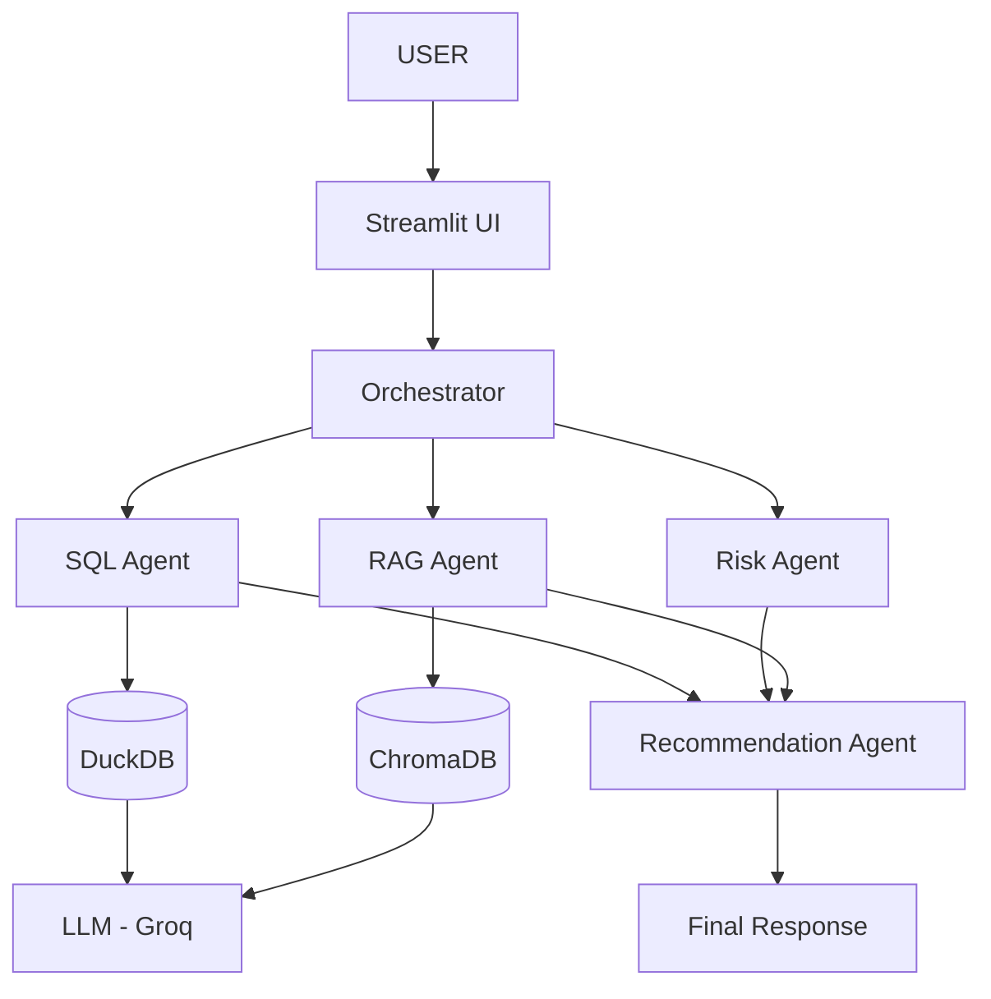
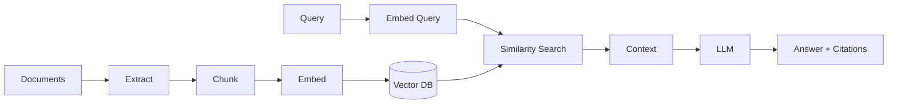
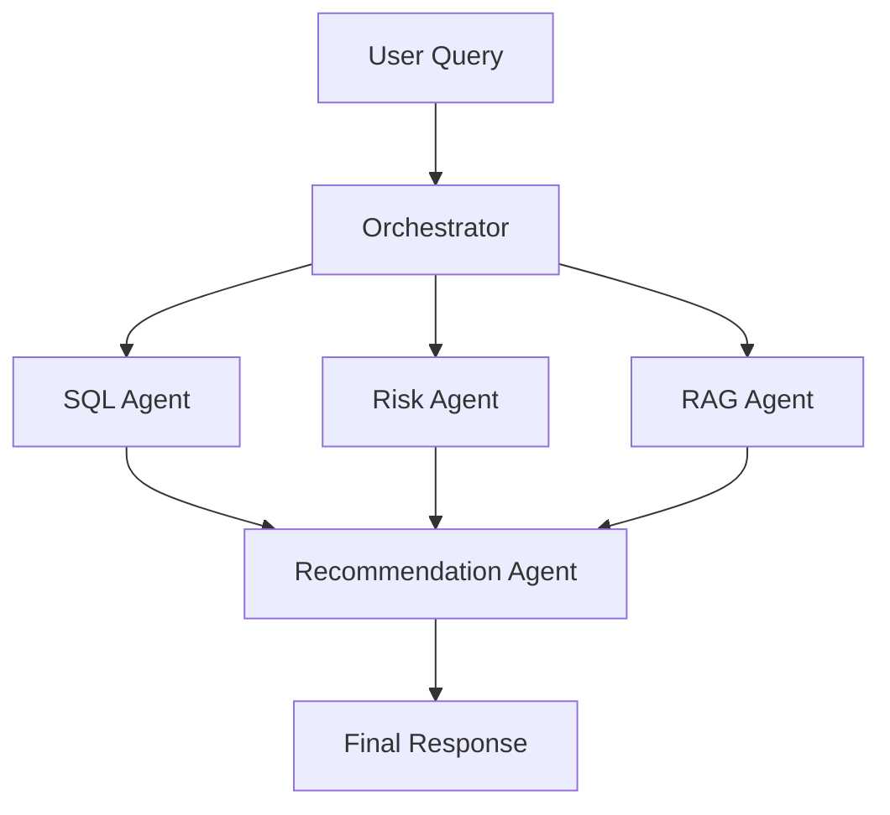

# An AI-Driven Healthcare Medication Adherence Analytics and Knowledge Retrieval System Using RAG and Agentic AI

**[Author Name] · [Department] · [College/University] · [City, Country] · [Email]**

---

**Abstract—** Medication non-adherence remains a critical challenge in global healthcare. This paper proposes a novel AI-driven system integrating an Analytics Assistant, a RAG-based Knowledge Base, and an Agentic AI Orchestrator. The system translates natural-language queries into SQL for deterministic analytics, leverages RAG for document-grounded policy retrieval, and uses a multi-agent framework to synthesize insights. The system minimizes LLM hallucinations while preserving data security. All data used is synthetic. The platform is intended for analytical and business prioritization support only.

**Keywords—** Medication Adherence, Healthcare Analytics, Generative AI, RAG, LLMs, Agentic AI, Risk Analysis, Decision Support

---

## I. INTRODUCTION

Medication adherence is the extent to which patients take medications as prescribed. Non-adherence leads to poor outcomes, hospitalizations, and billions in avoidable costs. Healthcare organizations need to analyze structured patient data AND unstructured policy documents simultaneously — a task requiring both SQL analytics and natural language processing.

This paper proposes a unified multi-agent AI system that combines:
- Natural language to SQL for structured analytics
- RAG for document-grounded policy retrieval
- LangGraph-based agent orchestration

---

## II. PROBLEM STATEMENT

Healthcare business teams require:
- Natural language querying of patient adherence databases
- High-risk patient identification and refill gap analysis
- Regional and pharmacy-level performance comparison
- Document-based policy retrieval with source citations
- Combining database results with unstructured guidelines

---

## III. OBJECTIVES

1. Enable natural-language querying of structured healthcare data
2. Analyze medication adherence and refill patterns
3. Identify high-risk patient groups
4. Build a RAG-based knowledge retrieval system
5. Implement specialized AI agents
6. Develop multi-agent orchestration for complex queries

---

## IV. RELATED WORK

The WHO estimated medication non-adherence costs $100–300B annually [1]. Lewis et al. introduced RAG to mitigate LLM hallucinations via dense retrieval [2]. Wu et al. demonstrated multi-agent frameworks significantly improve complex task completion rates [3]. Zhong et al. showed LLMs can generate accurate SQL from natural language [4].

---

## V. SYSTEM ARCHITECTURE

*Fig. 1. System Architecture*

---

## VI. ANALYTICS ASSISTANT

**Workflow:** User Question → Intent Detection → SQL Generation → Validation → Execution → AI Explanation → Response

Safety mechanisms: Read-only `SELECT` access, regex-based keyword blocking, retry logic.

---

## VII. RAG PIPELINE

*Fig. 2. RAG Pipeline*

---

## VIII. MULTI-AGENT ORCHESTRATION

*Fig. 3. Multi-Agent Workflow*

---

## IX. TECHNOLOGY STACK

| Technology | Purpose | Confirmed | Alternative |
|------------|---------|-----------|-------------|
| Python | Backend logic | Yes | Node.js, Java |
| DuckDB | Relational analytics DB | Yes | PostgreSQL, Snowflake |
| ChromaDB | Vector database | Yes | Pinecone, FAISS |
| Groq (LLaMA 3) | LLM | Yes | OpenAI GPT-4, Gemini |
| LangGraph | Agent orchestration | Yes | AutoGen, CrewAI |
| Streamlit | UI Dashboard | Yes | React, Gradio |

---

## X. ANALYTICAL METRICS

- **MPR** = Total days supply ÷ Measurement period days
- **PDC** = Unique covered days ÷ Measurement period days
- **Adherence Threshold** = PDC ≥ 80% (industry standard)

---

## XI. AI SAFETY

**Safety Statement:** *"This system is intended for analytical and business prioritization support and does not provide clinical diagnosis, medical advice, or treatment recommendations."*

Safety mechanisms: Hallucination prevention via RAG, SQL injection blocking, read-only database access, source citation enforcement.

---

## XII. EVALUATION PLAN

| Metric | Target | Status |
|--------|--------|--------|
| SQL Execution Accuracy | >95% | To be verified |
| RAG Precision@K | >90% | To be verified |
| Faithfulness | 100% | To be verified |
| Agent Routing Accuracy | >95% | To be verified |
| Response Latency | <5s | To be verified |

---

## XIII. ADVANTAGES AND LIMITATIONS

**Advantages:** Natural language querying, document-grounded responses, source citations, modular architecture, business prioritization support.

**Limitations:** LLM latency, data quality dependency, synthetic data constraints, multi-agent complexity, human oversight required.

---

## XIV. CONCLUSION

This paper proposed an AI-driven healthcare analytics system combining SQL-based analytics, RAG document retrieval, and multi-agent orchestration. By separating deterministic database operations from generative AI, the system minimizes hallucinations while providing actionable business insights. All outputs require human review and are not intended for clinical use.

---

## REFERENCES

[1] World Health Organization, "Adherence to long-term therapies: evidence for action," Geneva, 2003.

[2] P. Lewis et al., "Retrieval-Augmented Generation for Knowledge-Intensive NLP Tasks," NeurIPS, 2020.

[3] S. Wu et al., "AutoGen: Enabling Next-Gen LLM Applications via Multi-Agent Conversation," arXiv:2308.08155, 2023.

[4] V. Zhong, C. Xiong, R. Socher, "Seq2SQL: Generating Structured Queries from Natural Language," arXiv:1709.00103, 2017.
