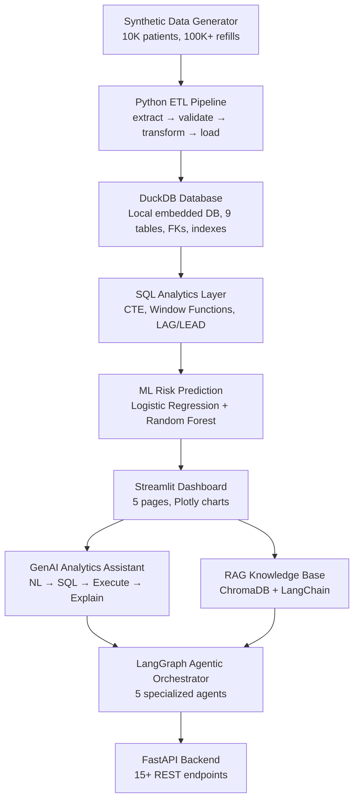

# Healthcare Intelligence & Patient Adherence Platform

> **Portfolio Demonstration** — Built with Python, DuckDB, ML, GenAI, RAG, and Agentic AI  
> Uses 100% synthetic patient data. Not a clinical decision-making system.

---

## 🎯 Business Problem

Pharmaceutical and healthcare organizations struggle to predict which patients will miss medication refills and why adherence is declining across regions, pharmacies, and medications.

**Core Business Question:**
> *"Which patients are at risk of medication refill drop-off, what are the major reasons, where are the problems concentrated, and what action should the business prioritize?"*

---

## 🏗️ Architecture



---

## ✨ Features

| Feature | Technology | Description |
|---------|-----------|-------------|
| **Synthetic Data** | Python, Faker, NumPy | 10K patients with realistic adherence correlations |
| **ETL Pipeline** | Pandas | Extract→Validate→Transform→Load with quality reporting |
| **SQL Analytics** | DuckDB | CTE, Window Functions, LAG/LEAD, RANK, ROW_NUMBER |
| **ML Risk Model** | Scikit-learn | Random Forest + Logistic Regression, SMOTE |
| **Dashboard** | Streamlit, Plotly | 5 interactive pages, dark theme |
| **GenAI Assistant** | OpenAI, FastAPI | NL→SQL→Execute→LLM Explain (no hallucinated numbers) |
| **RAG System** | LangChain, ChromaDB | 5 synthetic healthcare docs, source citations |
| **Agentic AI** | LangGraph | 5 specialized agents + orchestrator |
| **REST API** | FastAPI | 15+ endpoints with Pydantic validation |

---

## 🛠️ Technology Stack

- **Backend:** Python 3.11+, FastAPI, Uvicorn
- **Data:** Pandas, NumPy, Faker
- **Database:** DuckDB (Zero-dependency local SQL engine)
- **ML:** Scikit-learn, imbalanced-learn (SMOTE), joblib
- **GenAI:** Groq API / OpenAI API
- **RAG:** LangChain, ChromaDB, Huggingface embeddings
- **Agents:** LangGraph (orchestrator pattern)
- **Frontend:** Streamlit, Plotly
- **Testing:** pytest

---

## 🗄️ Database Schema

```
patients ──────────────────── prescriptions ─── medications
    │                               │
    ├── refills ◄──── pharmacies    │
    │                               │
    ├── engagements                 │
    ├── hcp_patient ─── hcp         │
    └── risk_predictions            │
                                    │
etl_logs (ETL audit trail)          │
```

**Key Design Points:**
- All FKs enforced at database level
- Composite PK on `hcp_patient`
- `was_on_time` boolean computed during data generation
- Indexes on all commonly-queried columns (region, patient_id, refill_date, risk_score)

---

## 📊 Data Correlations (Synthetic)

| Factor | Effect |
|--------|--------|
| Age > 65 | +8% miss probability |
| Uninsured | +10% miss probability |
| North region | -8% adherence baseline |
| High-miss pharmacy | +12% miss probability |
| 2+ previous missed refills | Escalating miss probability |
| Low engagement | Moderate risk signal |

---

## 🤖 ML Approach

**Target Definition:**  
`future_refill_dropoff = 1` if the patient does NOT refill within `expected_refill_date + 30 days`

**Models:** Logistic Regression (baseline) + Random Forest (selected)  
**Class Imbalance:** SMOTE oversampling  
**Key Metrics:** ROC-AUC, Recall (risk prioritization use case)

**Feature Categories:**
- Demographics (age, insurance, region)
- Refill behavior (gaps, missed count, adherence %)
- Temporal features (days since last refill)
- Engagement features (30d/90d engagement count)
- Trend features (early vs. recent refill gap)

---

## 🧠 Agentic AI Architecture

```
User Question
     ↓
Orchestrator (intent classification)
     ↓
┌────────────────────────────────────────┐
│  DataQuality  │  SQL    │  Risk        │
│  Agent        │  Agent  │  Agent       │
├───────────────┤         ├──────────────┤
│  RAG Agent    │         │  Recommendation │
│               │         │  Agent       │
└────────────────────────────────────────┘
     ↓
Structured Response (SUMMARY / INSIGHTS / ACTIONS / SOURCES)
```

**SQL Safety:** Only SELECT allowed. Blocked: DROP/DELETE/UPDATE/INSERT/ALTER/TRUNCATE

---

## 🚀 Quick Start

### Prerequisites
- Python 3.11+
- Git

### 1. Clone and setup environment
```bash
git clone <repo>
cd healthcare-intelligence-platform
cp .env.example .env
# Edit .env: set your GROQ_API_KEY (or OPENAI_API_KEY)
```

### 2. Install dependencies
```bash
pip install -r requirements.txt
```

### 4. One-command setup (recommended)
```bash
python setup.py
```
This runs: DB init → data generation → ETL → ML training → predictions → RAG ingestion → tests

### 5. Or run phases individually
```bash
python database/init_db.py          # Create DuckDB + schema
python data/generate_data.py        # Generate synthetic data
python etl/load.py                  # Load data into DuckDB
python ml/train.py                  # Train ML model
python ml/predict.py                # Generate risk predictions
python rag/ingest.py                # Build knowledge base
```

### 6. Start the application
You can use the provided Windows batch script or run the commands manually:
```bash
# Easy start (Windows)
run.bat

# Or Manual start:
# Terminal 1 — API
python -m uvicorn api.main:app --reload --host 0.0.0.0 --port 8000

# Terminal 2 — Dashboard
python -m streamlit run dashboard/app.py
```

**Access:**
- Dashboard: http://localhost:8501
- API Docs: http://localhost:8000/docs

---

## 🔑 Environment Variables

| Variable | Required | Description |
|----------|----------|-------------|
| `GROQ_API_KEY` | ⚠️ Optional | Recommended for fast, open-source AI features. |
| `OPENAI_API_KEY` | ⚠️ Optional | Can be used as a fallback if no Groq key is provided. |
| `RANDOM_SEED` | No | Data generation seed (default: 42) |

---

## 🧪 Testing

```bash
# All tests
python -m pytest tests/ -v

# Specific suites
python -m pytest tests/test_etl.py -v      # ETL validation
python -m pytest tests/test_agents.py -v   # SQL safety + agent routing
python -m pytest tests/test_ml.py -v       # ML risk scoring
```

---

## 💬 Example Questions

| Question | Agent Used |
|----------|-----------|
| "How many high-risk patients are in the North region?" | SQL Agent |
| "Which pharmacies have the highest missed refill rate?" | SQL Agent |
| "What interventions does the guideline recommend for poor adherence?" | RAG Agent |
| "Why has adherence declined in North and what should we do?" | Multi-Agent |
| "Show me the current data quality status." | Data Quality Agent |
| "Identify top risk factors and suggest business priorities." | Full Orchestration |

---

## ⚠️ Known Limitations

1. **Synthetic data only** — No real patient records; patterns are simplified simulations
2. **OpenAI required** for AI features — without API key, SQL execution works but explanations are limited
3. **Local RAG embeddings** — Without OpenAI, uses sentence-transformers (slower, requires model download)
4. **Single-node** — Not designed for production distributed deployment

---

## 🔮 Future Enhancements

1. **SHAP explainability** — Replace rule-based explanations with SHAP values
2. **Real-time prediction** — Kafka/streaming pipeline for live risk scoring
3. **AWS deployment** — See `docs/architecture.md` for cloud architecture design
4. **Fine-tuned LLM** — Domain-adapted model for healthcare analytics
5. **HIPAA compliance layer** — De-identification, audit logging, RBAC
6. **A/B testing** — Measure intervention effectiveness

---

## 📁 Project Structure

```
healthcare-intelligence-platform/
├── setup.py                    ← Single-command initialization
├── requirements.txt
├── .env.example
├── docker-compose.yml
├── data/
│   ├── generate_data.py        ← Synthetic data generator
│   ├── raw/                    ← Generated CSVs
│   ├── rejected/               ← ETL rejected records
│   └── logs/                   ← ETL execution logs
├── database/
│   ├── schema.sql              ← 9 tables + constraints
│   ├── indexes.sql             ← Performance indexes
│   ├── init_db.py              ← DB initialization
│   └── config.py               ← Connection configuration
├── etl/                        ← Extract → Validate → Transform → Load
├── sql/                        ← 5 SQL analytics files + Python wrapper
├── ml/                         ← Features, train, evaluate, predict
├── rag/                        ← ChromaDB ingestion + retriever
├── agents/                     ← 5 agents + LangGraph orchestrator
├── api/                        ← FastAPI with 15+ endpoints
├── dashboard/                  ← Streamlit + 5 pages
├── tests/                      ← pytest test suite
└── docs/                       ← Architecture, DB, ML, API documentation
```

---

*Built as a portfolio demonstration of end-to-end healthcare analytics engineering skills.*  
*All data is synthetic. Not intended for clinical use.*
