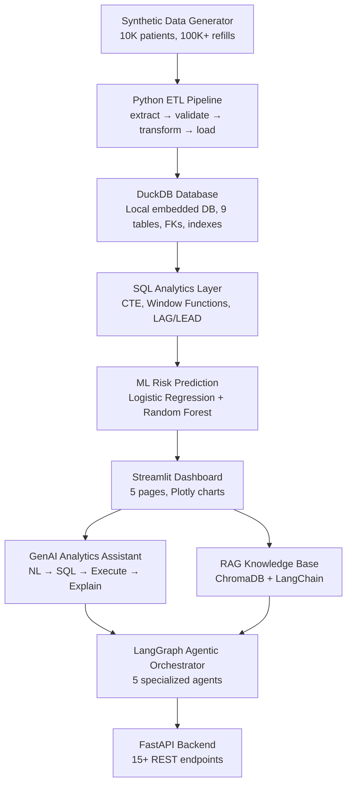

# Healthcare Intelligence & Patient Adherence Platform

> **Portfolio Demonstration** — Built with Python, DuckDB, ML, GenAI, RAG, and Agentic AI  
> Uses **100% synthetic patient data**. Not a clinical decision-making system.

[](https://www.python.org/)
[](https://duckdb.org/)
[](https://streamlit.io/)
[](https://fastapi.tiangolo.com/)
[](https://groq.com/)

---


## 🎯 Business Problem

Pharmaceutical and healthcare organizations struggle to predict which patients will miss medication refills and why adherence is declining across regions, pharmacies, and medications.

**Core Business Question:**
> *"Which patients are at risk of medication refill drop-off, what are the major reasons, where are the problems concentrated, and what action should the business prioritize?"*

---

## 🏗️ Architecture



---

## ✨ Key Features

| Feature | Technology | Description |
|---------|-----------|-------------|
| **Synthetic Data** | Python, Faker, NumPy | 10K patients with realistic adherence correlations |
| **ETL Pipeline** | Pandas | Extract→Validate→Transform→Load with quality reporting |
| **SQL Analytics** | DuckDB | CTE, Window Functions, LAG/LEAD, RANK, ROW_NUMBER |
| **ML Risk Model** | Scikit-learn | Random Forest + Logistic Regression, SMOTE |
| **Dashboard** | Streamlit, Plotly | 5 interactive pages, dark theme |
| **GenAI Assistant** | Groq (LLaMA 3) | NL→SQL→Execute→LLM Explain (no hallucinated numbers) |
| **RAG System** | LangChain, ChromaDB | 5 synthetic healthcare docs, source citations |
| **Agentic AI** | LangGraph | 5 specialized agents + orchestrator |
| **REST API** | FastAPI | 15+ endpoints with Pydantic validation |

---

## 🛠️ Technology Stack

- **Backend:** Python 3.11+, FastAPI, Uvicorn
- **Data:** Pandas, NumPy, Faker
- **Database:** DuckDB (Zero-dependency local SQL engine)
- **ML:** Scikit-learn, imbalanced-learn (SMOTE), joblib
- **GenAI:** Groq API (LLaMA 3)
- **RAG:** LangChain, ChromaDB, HuggingFace embeddings
- **Agents:** LangGraph (orchestrator pattern)
- **Frontend:** Streamlit, Plotly
- **Testing:** pytest

---

## 🧠 Agentic AI Architecture

```text
User Question
     ↓
Orchestrator (intent classification)
     ↓
┌────────────────────────────────────────┐
│  DataQuality  │  SQL    │  Risk        │
│  Agent        │  Agent  │  Agent       │
├───────────────┤         ├──────────────┤
│  RAG Agent    │         │  Recommendation│
│               │         │  Agent       │
└────────────────────────────────────────┘
     ↓
Structured Response (SUMMARY / INSIGHTS / ACTIONS / SOURCES)
```

**SQL Safety:** Only SELECT queries are allowed. Blocked keywords: `DROP`, `DELETE`, `UPDATE`, `INSERT`, `ALTER`, `TRUNCATE`.

---

## 🚀 Quick Start

### Prerequisites
- Python 3.11+
- Git

### 1. Clone and setup environment
```bash
git clone https://github.com/Nikhilkumar1020/Healthcare-Intelligence-Patient-Adherence-Platform.git
cd Healthcare-Intelligence-Patient-Adherence-Platform
cp .env.example .env
```
*Edit `.env` and set your `GROQ_API_KEY` to enable AI features.*

### 2. Install dependencies
```bash
pip install -r requirements.txt
```

### 3. One-command setup (recommended)
```bash
python setup.py
```
*This runs: DB init → data generation → ETL → ML training → predictions → RAG ingestion → tests.*

### 4. Start the application
You can use the provided Windows batch script or run the commands manually:
```bash
# Easy start (Windows)
run.bat

# Or Manual start:
# Terminal 1 — API
python -m uvicorn api.main:app --reload --host 0.0.0.0 --port 8000

# Terminal 2 — Dashboard
python -m streamlit run dashboard/app.py
```

**Access:**
- Dashboard: http://localhost:8501
- API Docs: http://localhost:8000/docs

---

## 💬 Example AI Questions

| Question | Agent Used |
|----------|-----------|
| "How many high-risk patients are in the North region?" | SQL Agent |
| "Which pharmacies have the highest missed refill rate?" | SQL Agent |
| "What interventions does the guideline recommend for poor adherence?" | RAG Agent |
| "Why has adherence declined in North and what should we do?" | Multi-Agent |
| "Show me the current data quality status." | Data Quality Agent |
| "Identify top risk factors and suggest business priorities." | Full Orchestration |

---

## 📁 Project Structure

```text
healthcare-intelligence-platform/
├── PDFs/                       ← Generated project reports and Q&A guides
├── data/                       ← Synthetic data generation & outputs
├── database/                   ← DuckDB schema, indexes, and initialization
├── etl/                        ← Extract → Validate → Transform → Load pipeline
├── sql/                        ← SQL analytics queries
├── ml/                         ← Feature engineering, training, and prediction
├── rag/                        ← ChromaDB ingestion and retriever
├── agents/                     ← LangGraph orchestrator and 5 specialized agents
├── api/                        ← FastAPI backend (15+ REST endpoints)
├── dashboard/                  ← Streamlit frontend (5 pages)
├── tests/                      ← Pytest test suite
├── setup.py                    ← Single-command initialization script
└── run.bat                     ← Startup script for API and Dashboard
```

---

*Built as a portfolio demonstration of end-to-end healthcare analytics engineering skills.*  
*All data is synthetic. Not intended for clinical use.*
